# 🎷 Proyecto WordPress - Audiophile Ecommerce

Este repositorio contiene una adaptación del sitio **Audiophile** desarrollada con **WordPress** como CMS, utilizando **Laragon** como entorno de desarrollo local. El sitio simula una tienda de productos de audio (auriculares, parlantes y más), con un diseño limpio y funcional.

Este proyecto fue creado como práctica personal para aprender a trabajar con WordPress a nivel profesional y desarrollar funcionalidades de una tienda online.

---

## ⚙️ Características del Proyecto

- Sitio basado en el diseño original de [Audiophile](https://audiophile-ecommerce.vercel.app/) (referencia online).
- Maquetado para escritorio (desktop) con diseño **responsive** adaptado a **tablets**.
- Desarrollo realizado con **WordPress clásico** (no se usó Elementor ni constructores).
- Base de datos exportada y lista para importar en otro entorno local.
- Funcionalidades: navegación por categorías, carrito de compras simulado, detalles de producto, y más.

---

## 📁 Estructura del Repositorio

```
wordpress-audiophile/
├── wp-admin/
├── wp-content/
│   ├── themes/ (tema personalizado)
│   └── plugins/
├── database/
│   └── backup.sql (archivo de base de datos)
├── images/ (capturas de pantalla)
├── wp-config.php
├── README.md
└── .gitignore
```

---

## 🪰 Requisitos

- [Laragon](https://laragon.org/) (recomendado) o cualquier entorno con:
  - PHP
  - MySQL o MariaDB
- Navegador moderno (Chrome, Firefox, etc.)
- phpMyAdmin (incluido en Laragon)
- Composer (opcional)

---

## 🚀 Cómo usar este repositorio

1. **Clonar el repositorio**

   Cloná este repositorio dentro de la carpeta `www` de Laragon:

   ```bash
   git clone https://github.com/tuusuario/wordpress-audiophile.git
   ```

2. **Importar la base de datos**

   - Abrí `http://localhost/phpmyadmin` o `http://localhost/adminer`.
   - Creá una nueva base de datos (por ejemplo: `audiophile`).
   - Importá el archivo SQL ubicado en `database/backup.sql`.

3. **Configurar **``

   - Editá el archivo `wp-config.php` en la raíz del proyecto.
   - Cambiá el nombre de la base de datos y las credenciales si es necesario:
     ```php
     define( 'DB_NAME', 'audiophile' );
     define( 'DB_USER', 'root' );
     define( 'DB_PASSWORD', '' );
     define( 'DB_HOST', 'localhost' );
     ```

4. **Levantar el servidor local**

   - Iniciá Laragon.
   - Accedé al sitio desde tu navegador:\
     `http://localhost/wordpress-audiophile`

---

## 📝 Notas importantes

- La carpeta `wp-content/uploads` **no está incluida** por cuestiones de peso. Puedes agregar tus propias imágenes si es necesario.
- El sitio está adaptado para **escritorio y tablets**. No tiene aún diseño responsive para móviles.
- Este proyecto no incluye pasarela de pagos ni funcionalidades reales de ecommerce.

---

## 🖼️ Capturas de pantalla

### 🏠 Home
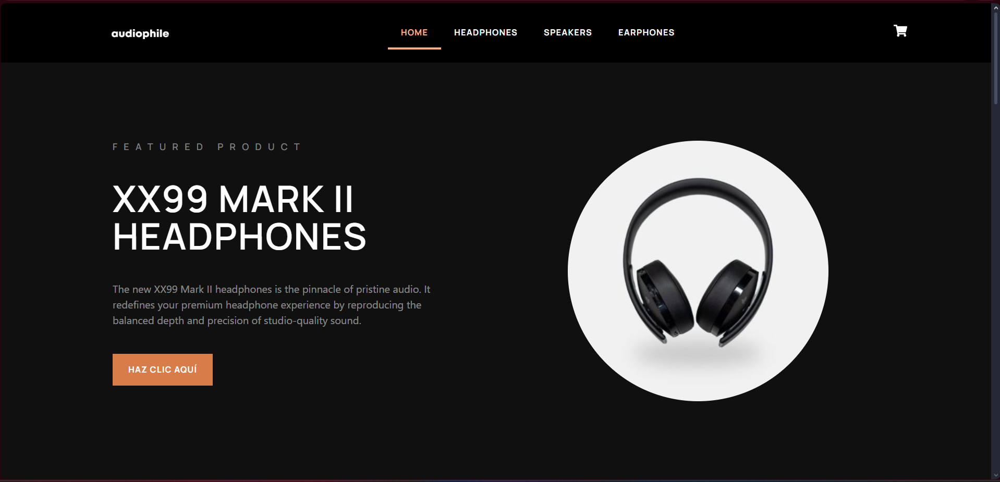
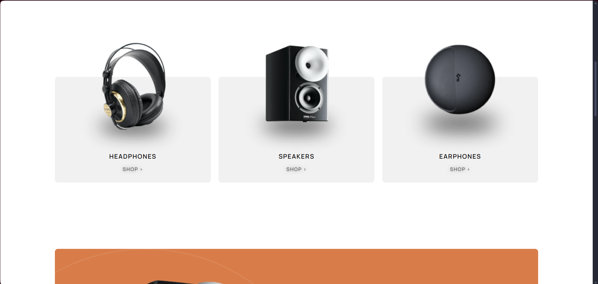
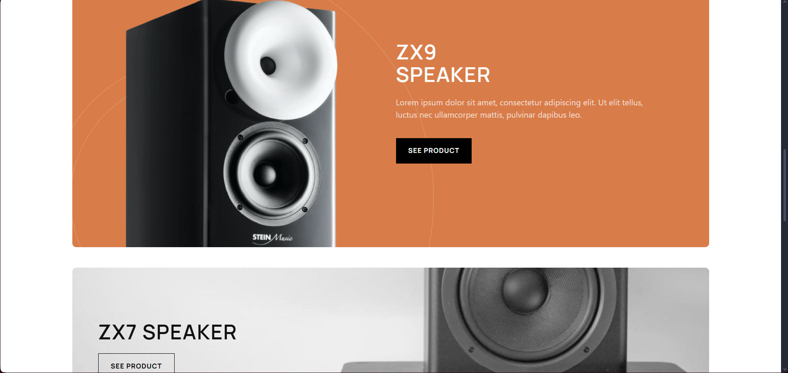
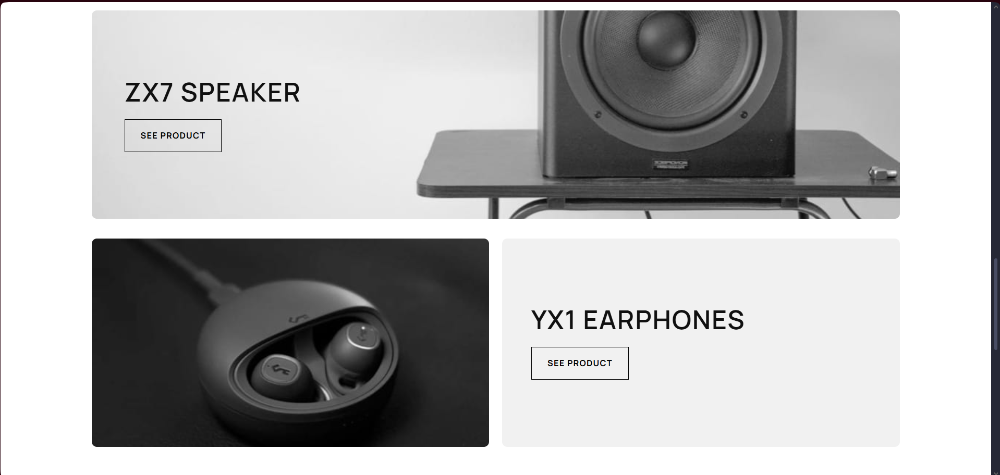
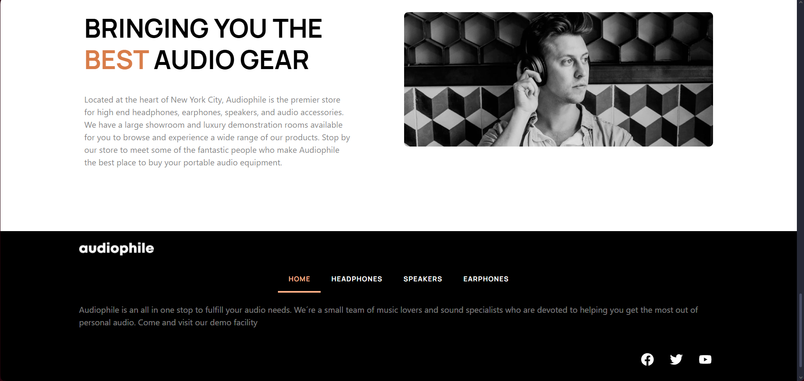

### 🎧 Headphones
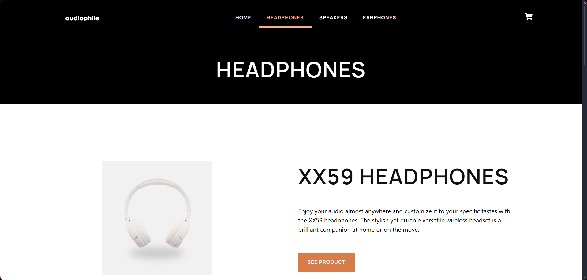
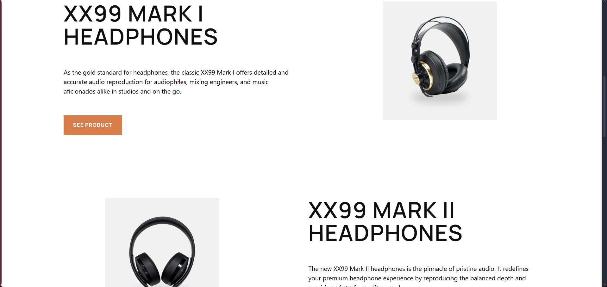

### 🔊 Speakers
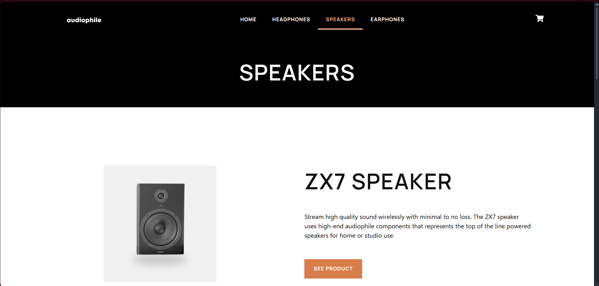

### 🎶 Earphones
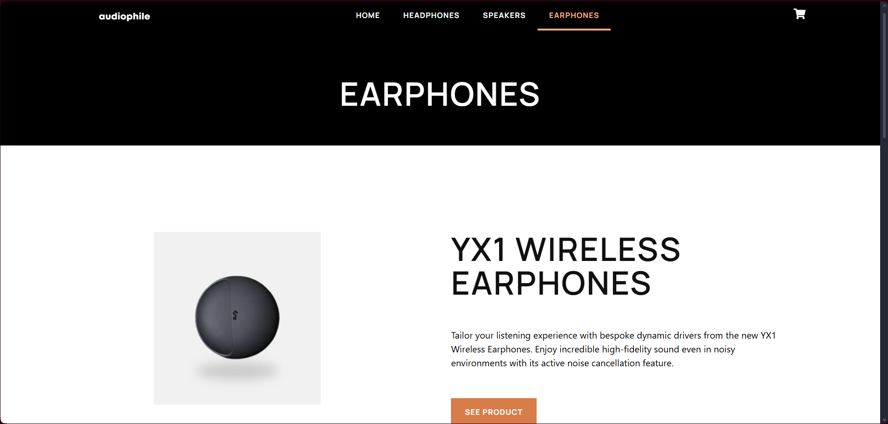

### 📦 Product
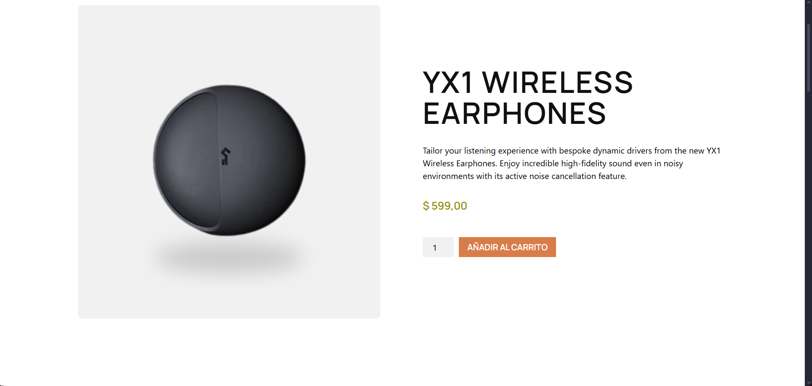
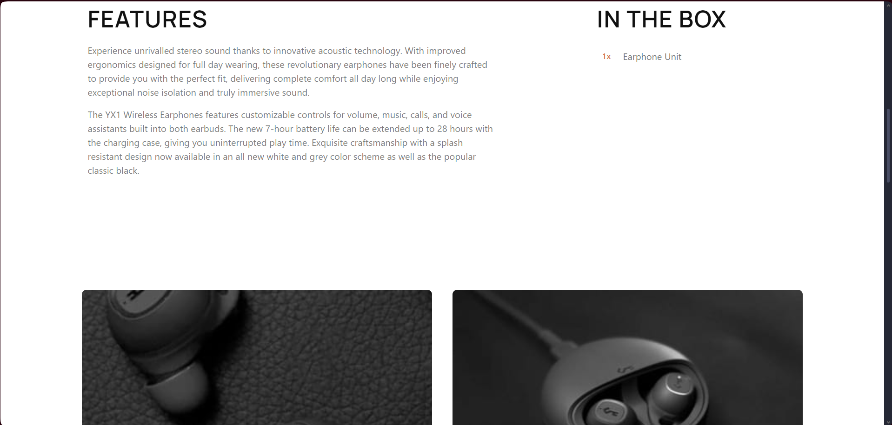

### 🛒 Cart

