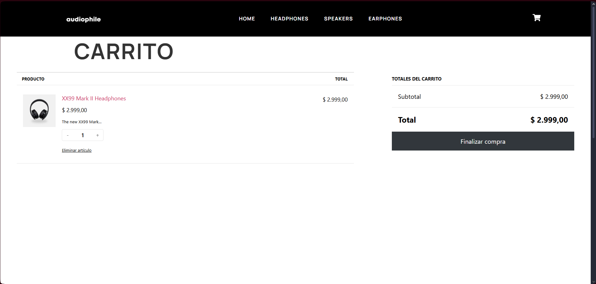

# Proyecto WordPress - Página Web

Este repositorio contiene los archivos de un sitio web desarrollado con WordPress usando Laragon en local.

## Requisitos

- Laragon (o XAMPP, MAMP, etc.)
- PHP y MySQL
- Composer (opcional)

## Instrucciones

1. Clona el repositorio dentro de la carpeta `www` de Laragon:

2. Importa la base de datos:
   - Abre `http://localhost/phpmyadmin`.
   - Crea una nueva base de datos (usa el mismo nombre que tenía localmente o cambia `wp-config.php`).
   - Importa el archivo `database/backup.sql`.

3. Configura el archivo `wp-config.php` con el nombre de la base de datos y credenciales de tu servidor local.

4. Inicia Laragon y accede al sitio en: `http://localhost/wordpress-proyecto`.

---

## Nota

No se incluyen imágenes o medios del sitio (`wp-content/uploads`) por motivos de peso. Puedes añadirlos si los necesitas.

## 🖼️ Capturas de pantalla

### Home

### Headphones

### Speakers

### Earphones

### Product

### Cart

